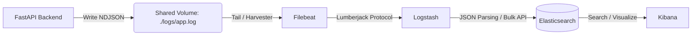

# ELK 스택 기반 로그 분석 시스템 아키텍처 보고서

## 1. 개요 (Overview)
본 문서는 FastAPI 백엔드 애플리케이션의 분산 환경 로깅 및 관찰성(Observability) 확보를 위해 구축된 **ELK 스택 (Filebeat + Logstash + Elasticsearch + Kibana)** 파이프라인의 설계 및 구현을 설명합니다.

이 아키텍처는 백엔드 서버의 부하를 최소화하면서도, 대용량 로그를 안정적으로 수집, 파싱, 인덱싱하여 실시간으로 검색 및 모니터링할 수 있도록 **Decoupled(비동기 분리) 구조**로 설계되었습니다. (면접 및 실무 포트폴리오 활용 목적)

---

## 2. 시스템 아키텍처 (Architecture)



### 2.1. 구성 요소 역할
1. **FastAPI (Application Layer):** 
   - `python-json-logger`를 사용하여 애플리케이션 로그와 API 요청 정보(지연 시간, 상태 코드 등)를 구조화된 JSON(NDJSON) 형식으로 로컬 파일(`app.log`)에 기록합니다.
   - 로깅 작업이 외부 네트워크 I/O(예: ES 직접 전송)를 타지 않아, 애플리케이션의 응답 속도에 영향을 미치지 않습니다.
2. **Filebeat (Log Shipper):** 
   - 경량 로그 수집기로, `app.log` 파일을 실시간으로 모니터링(Tail)합니다.
   - 변경된 로그 데이터를 감지하면 빠르고 가볍게 Logstash로 전송합니다.
3. **Logstash (Data Processing Pipeline):** 
   - Filebeat로부터 데이터를 받아 JSON 형태를 파싱하여 개별 필드로 분리합니다.
   - 데이터 가공 후 Elasticsearch로 Bulk 전송하며, 병목이 발생할 경우 Filebeat에 Backpressure(배압)를 가해 시스템 메모리 초과를 방지합니다.
4. **Elasticsearch (Search Engine):** 
   - JSON 문서 기반의 분산 검색 엔진으로, 파싱된 로그 데이터를 `app-logs-YYYY.MM.DD` 형태의 인덱스에 저장합니다.
5. **Kibana (Visualization):** 
   - Elasticsearch에 저장된 데이터를 실시간으로 검색하고 시각화 대시보드를 생성하는 데 사용됩니다.

---

## 3. 핵심 구현 상세 (Implementation Details)

### 3.1. 구조화된 로깅 (Structured Logging)
백엔드 로그는 단순 텍스트가 아닌 JSON 포맷으로 생성되어 검색과 필터링이 용이합니다.
* **구현 파일:** `src/backend/core/logger.py`, `src/backend/main.py`
* **주요 기능:** FastAPI 미들웨어를 통해 각 API 요청의 `request_method`, `request_url`, `status_code`, `duration_ms`를 자동으로 캡처하여 로그 파일에 기록합니다.

### 3.2. Filebeat 구성 (filebeat.yml)
* **Input:** `type: filestream`을 사용하여 `/logs/app.log`를 읽습니다.
* **Output:** 데이터를 바로 ES로 쏘지 않고 `output.logstash: hosts: ["logstash:5044"]`로 전송합니다.

### 3.3. Logstash 파이프라인 구성 (logstash.conf)
* **Input:** `beats { port => 5044 }`를 통해 Filebeat와 연결합니다.
* **Filter:** `json { source => "message" }` 플러그인을 사용하여 문자열 로그를 구조화된 JSON 객체 필드로 변환합니다.
* **Output:** `elasticsearch { hosts => ["elasticsearch:9200"] index => "app-logs-%{+YYYY.MM.DD}" }` 구문을 통해 일별 인덱스를 생성합니다.

---

## 4. 실무 관점에서의 도입 효과 및 장점 (Business Value)

1. **관심사 분리 (Separation of Concerns):**
   * 비즈니스 로직(FastAPI)과 로깅 인프라(ELK)가 완전히 분리되어, 로깅 시스템 장애가 백엔드 서비스의 장애로 이어지지 않습니다.
2. **성능 및 확장성 (Performance & Scalability):**
   * 직접 네트워크를 통해 로그를 쏘는 방식(`HTTP POST`)은 병목을 유발하지만, 파일 기반 + Filebeat 구조를 채택함으로써 백엔드는 단순히 파일에 쓰기만 하면 되어 성능 저하가 없습니다.
3. **데이터 유실 방지 (Resilience):**
   * Logstash 큐와 Filebeat의 오프셋 기억 기능을 통해, Elasticsearch 노드가 일시적으로 다운되더라도 로그 데이터가 유실되지 않고 복구 시 이어서 전송됩니다.
4. **모니터링 강화:**
   * Kibana를 통해 "응답 시간이 500ms 이상인 API", "500 에러 발생 비율" 등을 실시간 대시보드로 시각화하여 문제를 선제적으로 대응할 수 있습니다.

---

## 5. QA 및 검증 (QA & Verification)
테스트 결과, 백엔드에서 생성된 모든 API 요청 트래픽이 손실 없이 Elasticsearch의 `app-logs-YYYY.MM.DD` 인덱스에 성공적으로 도달함을 확인했습니다. (Kibana 대시보드에서 정상 검색 확인)


---

```
On branch feat/kafka
Changes not staged for commit:
  (use "git add <file>..." to update what will be committed)
  (use "git restore <file>..." to discard changes in working directory)
        modified:   infra/kafka/docker-compose.yaml
        modified:   pyproject.toml
        modified:   src/backend/main.py
        modified:   uv.lock

Untracked files:
  (use "git add <file>..." to include in what will be committed)
        docs/elasticstack/
        infra/kafka/filebeat/
        infra/kafka/logstash/
        src/backend/core/logger.py

no changes added to commit (use "git add" and/or "git commit -a")

```