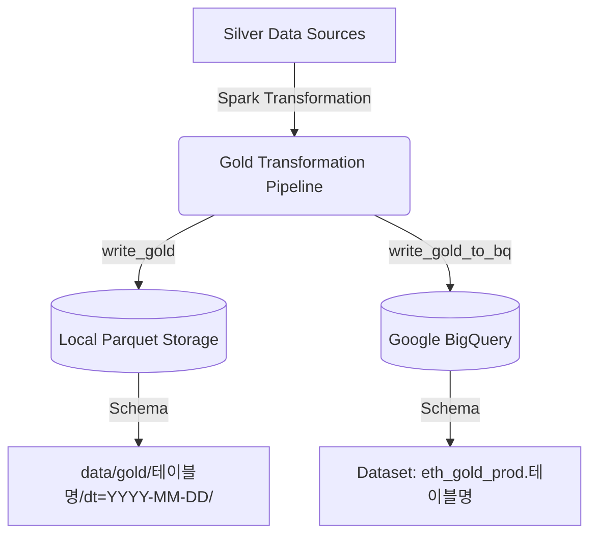

# Gold Layer 데이터 변환 파이프라인 명세서 (gold_transform.md)

이 문서는 실버 레이어(Silver Layer)의 정제된 데이터를 집계 및 분석하여, 대시보드 시각화 및 비즈니스 의사결정에 직접 활용되는 **골드 레이어(Gold Layer)** 데이터 파이프라인 3종의 세부 분석 로직과 스키마 명세를 정리한 것입니다.

---

## 📌 목차
1. [개요 (Overview)](#1-개요-overview)
2. [1. Top Whales Daily (일별 고래 행동 분석)](#2-1-top-whales-daily-일별-고래-행동-분석)
3. [2. Market Flow Hourly (시간별 시장 흐름 및 거래소 압력 분석)](#3-2-market-flow-hourly-시간별-시장-흐름-및-거래소-압력-분석)
4. [3. Token Popularity Daily (일별 토큰 인기도 랭킹)](#4-3-token-popularity-daily-일별-토큰-인기도-랭킹)
5. [💾 공통 저장 및 적재 메커니즘](#-공통-저장-및-적재-메커니즘)

---

## 1. 개요 (Overview)

골드 레이어는 데이터 웨어하우스(BigQuery) 및 시각화 도구(BI Tool)에서 복잡한 조인이나 연산 없이 즉각 쿼리하여 활용할 수 있도록 최적화된 **다차원 분석 모델(Dimensional Model)** 계층입니다. 
각 파이프라인은 PySpark을 활용하여 대용량 분산 처리를 수행하며, 실행 완료 후 로컬 Parquet 파일 및 Google BigQuery 테이블에 동시에 적재됩니다.

---

## 2. 1. Top Whales Daily (일별 고래 행동 분석)

- **소스 코드 위치**: [top_whales_daily.py](file:///c:/llm/eth-proj-v2/src/gold/transform/top_whales_daily.py)
- **핵심 질문**: *"오늘 어떤 고래(Whale) 지갑이 시장을 주도하고 있으며, 매집(Accumulate) 중인가 아니면 투매(Dump) 중인가?"*
- **분석 단위**: `address` + `dt` (지갑 주소별 일별 집계)

### 💡 핵심 변환 및 산출 로직

1. **송수신 분리 집계 및 Outer Join**:
   - Silver Layer의 [whale_txns](file:///c:/llm/eth-proj-v2/src/schema/silver_schema.py) 테이블을 기반으로 `from_address`(송신) 데이터와 `to_address`(수신) 데이터를 분리하여 일별 총액 및 트랜잭션 횟수를 집계한 후, `address`와 `dt` 기준으로 Outer Join합니다.
2. **지표 계산 공식**:
   - **순유입량 (Net Flow)**: $\text{net\_flow\_eth} = \text{total\_recv\_eth} - \text{total\_sent\_eth}$
   - **총 거래대금 (Total Activity)**: $\text{total\_activity\_eth} = \text{total\_sent\_eth} + \text{total\_recv\_eth}$
   - **총 거래횟수 (Total Tx Count)**: $\text{total\_tx\_count} = \text{tx\_count\_as\_sender} + \text{tx\_count\_as\_receiver}$
3. **고래 등급 (Whale Tier) 재분류**:
   - 당일의 총 거래대금(`total_activity_eth`)을 기준으로 고래의 등급을 재산정합니다.
     - `total_activity_eth >= 1000` ➡️ **Humpback** (혹등고래)
     - `total_activity_eth >= 500` ➡️ **Whale** (고래)
     - `total_activity_eth >= 100` ➡️ **Shark** (상어)
     - `Otherwise` ➡️ **Crab** (게)
4. **포지션 레이블 (Position Label)**:
   - 순유입량(`net_flow_eth`)에 따라 투자 성향을 분류합니다.
     - `net_flow_eth > 0` ➡️ **Accumulator** (매집자)
     - `net_flow_eth < 0` ➡️ **Dumper** (투매자)
     - `Otherwise` ➡️ **Neutral** (중립)
5. **순위(Ranking) 부여**:
   - Spark Window 함수를 활용하여 하루(`dt`) 내에서 각 고래의 순위를 계산합니다.
     - `rank_accumulator`: 순유입량 내림차순 (매집왕)
     - `rank_dumper`: 순유입량 오름차순 (투매왕)
     - `rank_activity`: 총 거래대금 내림차순 (활동왕)
6. **대표 Entity 매핑 보강**:
   - 하루 동안 해당 지갑이 보낸 트랜잭션 중 가장 빈번하게 매핑된 Entity 이름(`from_entity`)과 카테고리(`from_category`)를 추출하여 `entity_name` 및 `entity_category`로 결합 보강합니다.

### 📊 데이터 스키마 (Schema)

| 컬럼명 | 데이터 타입 | 설명 | 산출 방식 및 특징 |
| :--- | :--- | :--- | :--- |
| **dt** | DATE | 기준 일자 | 파티션 컬럼 (`YYYY-MM-DD`) |
| **address** | STRING | 고래 지갑 주소 | Primary Key 역할 |
| **entity_name** | STRING | 대표 Entity 이름 | 최빈값 매핑 (예: `Binance`, `Jump Trading`) |
| **entity_category** | STRING | 대표 Entity 카테고리 | 최빈값 매핑 (예: `CEX`, `Dex`, `Fund`) |
| **whale_tier** | STRING | 고래 활동 등급 | `Humpback`, `Whale`, `Shark`, `Crab` |
| **position_label** | STRING | 당일 포지션 | `Accumulator`, `Dumper`, `Neutral` |
| **net_flow_eth** | DOUBLE | 순유입량 (ETH) | 수신량 - 송신량 (소수점 6자리 반올림) |
| **total_sent_eth** | DOUBLE | 총 송신량 (ETH) | 지갑에서 나간 총 금액 |
| **total_recv_eth** | DOUBLE | 총 수신량 (ETH) | 지갑으로 들어온 총 금액 |
| **total_activity_eth** | DOUBLE | 총 거래대금 (ETH) | 송신량 + 수신량 (소수점 6자리 반올림) |
| **total_tx_count** | LONG | 총 거래 횟수 | 송신 횟수 + 수신 횟수 |
| **tx_count_as_sender** | LONG | 송신자로서의 거래 횟수 | - |
| **tx_count_as_receiver**| LONG | 수신자로서의 거래 횟수 | - |
| **rank_accumulator** | INTEGER | 일별 매집 순위 | `net_flow_eth` 내림차순 순위 |
| **rank_dumper** | INTEGER | 일별 투매 순위 | `net_flow_eth` 오름차순 순위 |
| **rank_activity** | INTEGER | 일별 활동량 순위 | `total_activity_eth` 내림차순 순위 |
| **flag_high_freq** | BOOLEAN | 고빈도 거래 여부 | 당일 송신 트랜잭션 중 고빈도 플래그 존재 여부 |

> [!TIP]
> **Whale Tier**는 매일 유동적으로 변하는 자산 흐름을 즉각 반영하기 위해 고정 값이 아닌 당일 활동량(`total_activity_eth`) 기준으로 동적 산출됩니다.

### 🚀 실행 방법
```bash
uv run src/gold/transform/top_whales_daily.py --date 2026-05-01
```

---

## 3. Market Flow Hourly (시간별 시장 흐름 및 거래소 압력 분석)

- **소스 코드 위치**: [market_flow_hourly.py](../../src/gold/transform/market_flow_hourly.py)
- **핵심 질문**: *"지금 이 시간 고래들이 거래소로 자금을 대량 입금하여 매도 압력을 높이고 있는가, 아니면 출금하여 매집하고 있는가?"*
- **분석 단위**: `dt` + `hour` + `flow_type` (시간별 흐름 유형별 집계)

### 💡 핵심 변환 및 산출 로직

1. **시간대별 기본 지표 집계**:
   - `dt`, `hour`, `flow_type` 단위로 그룹화하여 총 ETH 거래량(`total_eth`)을 계산합니다.
2. **거래소 입출금 비율 기반 시장 압력 지수 (Market Pressure Index)**:
   - 동일 시간대에 일어난 `CEX_DEPOSIT`과 `CEX_WITHDRAWAL` 총량을 피벗(Pivot)하여 비율을 도출합니다.
     - $\text{deposit\_withdrawal\_ratio} = \frac{\text{cex\_deposit\_eth}}{\text{cex\_withdrawal\_eth}}$
   - 해당 비율에 따라 매수/매도 압력 레이블(`pressure_label`)을 확정합니다.
     - `ratio > 1.5` ➡️ **STRONG_SELL_PRESSURE**
     - `ratio > 1.0` ➡️ **MILD_SELL_PRESSURE**
     - `ratio < 0.67` ➡️ **STRONG_BUY_PRESSURE**
     - `ratio < 1.0` ➡️ **MILD_BUY_PRESSURE**
     - `Otherwise` ➡️ **NEUTRAL**

### 📊 데이터 스키마 (Schema)

| 컬럼명 | 데이터 타입 | 설명 | 산출 방식 및 특징 |
| :--- | :--- | :--- | :--- |
| **dt** | DATE | 기준 일자 | 파티션 컬럼 (`YYYY-MM-DD`) |
| **hour** | INTEGER | 기준 시간 | 0 ~ 23시 |
| **flow_type** | STRING | 자금 이동 유형 | `CEX_DEPOSIT`, `CEX_WITHDRAWAL`, `DEX_TRADE` 등 |
| **total_eth** | DOUBLE | 해당 유형의 총 거래량 (ETH) | 소수점 4자리 반올림 |
| **cex_deposit_eth** | DOUBLE | CEX 입금 총량 (ETH) | CEX로 유입된 거래량 총합 |
| **cex_withdrawal_eth**| DOUBLE | CEX 출금 총량 (ETH) | CEX에서 유출된 거래량 총합 |
| **deposit_withdrawal_ratio** | DOUBLE | 거래소 입출금 비율 | 입금량 / 출금량 (출금량이 0인 경우 무한대 발산 방지를 위해 null 처리) |
| **pressure_label** | STRING | 거래소 압력 진단 | `STRONG_SELL_PRESSURE`, `STRONG_BUY_PRESSURE` 등 |

> [!IMPORTANT]
> `cex_deposit_eth`, `cex_withdrawal_eth`, `deposit_withdrawal_ratio`, `pressure_label` 지표는 시간대(`dt`, `hour`) 레벨에서 조인된 지표로, 동일한 시간 내의 모든 `flow_type` 레코드에 동일하게 복사되어 시간 단위 매크로 분석을 쉽게 만듭니다.
> 특히 **출금량(`cex_withdrawal_eth`)이 0**인 시간대의 경우, 비율 왜곡을 방지하기 위해 `deposit_withdrawal_ratio`는 `null`로 저장되지만, 시장 상태(`pressure_label`)는 입금액 유무에 따라 `STRONG_SELL_PRESSURE` 또는 `NEUTRAL`로 정확하게 계산됩니다.

### 🚀 실행 방법
```bash
uv run src/gold/transform/market_flow_hourly.py --date 2026-05-01
```

---

## 4. Token Popularity Daily (일별 토큰 인기도 랭킹)

- **소스 코드 위치**: [token_popularity_daily.py](file:///c:/llm/eth-proj-v2/src/gold/transform/token_popularity_daily.py)
- **핵심 질문**: *"오늘 하루 거래 횟수, 참여 주소 수, 유동 규모를 종합적으로 고려할 때 가장 핫했던 ERC-20 토큰은 무엇인가?"*
- **분석 단위**: `token_address` + `dt` (토큰별 일별 집계)

### 💡 핵심 변환 및 산출 로직

1. **정상 트랜잭션 필터링**:
   - Silver Layer의 [token_flow](file:///c:/llm/eth-proj-v2/src/schema/silver_schema.py) 테이블에서 성공한 트랜잭션(`status == 1`)만 필터링하여 분석 신뢰도를 높입니다.
2. **토큰별 3차원 기본 지표 집계**:
   - **트랜잭션 수 (Tx Count)**: 토큰의 일별 트랜잭션 총합
   - **총 볼륨 (Total Volume)**: 당일 전송된 토큰 총 액수
   - **고유 전송 경로 수 (Unique Addresses)**: `from_address`와 `to_address`를 결합하여 고유한 전송 경로 쌍(`approx_count_distinct`)을 계산 (단순 지갑 개수보다 활발한 네트워크 분산도를 측정)
   - **CEX 순유입량 (CEX Net Flow)**: CEX로 유입된 양(수신처가 CEX)에서 CEX에서 유출된 양(송신처가 CEX)을 차감하여 거래소 유동성 증감 측정
3. **Min-Max 정규화 (Normalization)**:
   - 당일(`dt` 파티션 내) 토큰들 간의 단위 편차를 없애기 위해 세 가지 핵심 지표에 대해 0에서 1 사이로 정규화를 진행합니다.
     $$\text{Normalized Value} = \frac{\text{Value} - \text{Min}}{\text{Max} - \text{Min}}$$
4. **가중 점수 기반 인기도 (Popularity Score) 산정**:
   - 정규화된 3대 지표에 가중치를 곱하여 최종 100점 만점 기준의 인기도 점수(`popularity_score`)를 도출합니다.
     - **트랜잭션 빈도 (Weight: 40%)**
     - **고유 네트워크 분산도 (Weight: 35%)**
     - **거래대금 볼륨 (Weight: 25%)**
     - $\text{popularity\_score} = (\text{n\_tx} \times 0.40) + (\text{n\_addr} \times 0.35) + (\text{n\_vol} \times 0.25)$
5. **인기도 티어 (Popularity Tier) 및 흐름 레이블**:
   - 일별 랭킹(`rank_popularity`)에 따라 인기도 등급을 부여합니다.
     - `1위` ➡️ **Top1**
     - `2 ~ 3위` ➡️ **Top3**
     - `4 ~ 10위` ➡️ **Top10**
     - `11 ~ 50위` ➡️ **Hot**
     - `Otherwise` ➡️ **Normal**
   - CEX 순유입량(`cex_net_flow`)에 따라 **CEX_INFLOW** (입금 우세), **CEX_OUTFLOW** (출금 우세), **NEUTRAL** (중립)로 분류합니다.

### 📊 데이터 스키마 (Schema)

| 컬럼명 | 데이터 타입 | 설명 | 산출 방식 및 특징 |
| :--- | :--- | :--- | :--- |
| **dt** | DATE | 기준 일자 | 파티션 컬럼 (`YYYY-MM-DD`) |
| **token_address** | STRING | ERC-20 토큰 계약 주소 | Primary Key 역할 |
| **symbol** | STRING | 토큰 심볼 | 예: `USDC`, `USDT`, `WETH` |
| **token_name** | STRING | 토큰 전체 이름 | 예: `USD Coin`, `Wrapped Ether` |
| **rank_popularity** | INTEGER | 당일 종합 인기도 순위 | `popularity_score` 기준 내림차순 |
| **popularity_tier** | STRING | 인기도 그룹 티어 | `Top1`, `Top3`, `Top10`, `Hot`, `Normal` |
| **popularity_score** | DOUBLE | 종합 인기도 점수 | 0.0 ~ 1.0 (가중 합산) |
| **tx_count** | LONG | 트랜잭션 횟수 | - |
| **total_volume** | DOUBLE | 총 유동 볼륨 | 토큰 전송 총합 (소수점 4자리 반올림) |
| **unique_addresses** | LONG | 고유 전송 경로 수 | `from` 및 `to` 지갑 조합의 고유 수 |
| **cex_net_flow** | DOUBLE | 거래소 일별 순유입량 | 수신(CEX)합 - 송신(CEX)합 |
| **cex_flow_label** | STRING | 거래소 유동성 흐름 레이블 | `CEX_INFLOW`, `CEX_OUTFLOW`, `NEUTRAL` |

### 🚀 실행 방법
```bash
uv run src/gold/transform/token_popularity_daily.py --date 2026-05-01
```

---

## 💾 공통 저장 및 적재 메커니즘

모든 Gold 변환 파이프라인의 결과물은 공통 모듈인 [utils.py](file:///c:/llm/eth-proj-v2/src/gold/utils.py)의 저장 함수들을 호출하여 두 군데에 나누어 적재됩니다.



### 1. 로컬 저장 (`write_gold`)
- **경로**: `data/gold/{table_name}/dt={date_val}/`
- **포맷**: Parquet 포맷으로 저장되며 일자(`dt`) 단위로 디렉토리 파티셔닝이 적용됩니다.

### 2. BigQuery 적재 (`write_gold_to_bq`)
- **대상**: GCP BigQuery의 지정된 프로덕션 데이터셋 (예: `eth_gold_prod`) 내에 각각 동일한 이름의 테이블로 저장됩니다.
- **모드**: 일자별 멱등성(Idempotency) 유지를 위해 특정 날짜(`dt`) 데이터를 매번 덮어쓰는(Overwrite) 방식으로 트랜잭션 안전성을 보장합니다.

---

> [!NOTE]  
> 본 골드 테이블 명세는 파이프라인 변경 사항 및 비즈니스 요건 변화에 따라 수시로 업데이트될 수 있습니다. 
> 쿼리 성능 최적화를 위해 BigQuery 파티션 및 클러스터링 필드 설정을 준수해 주세요.
