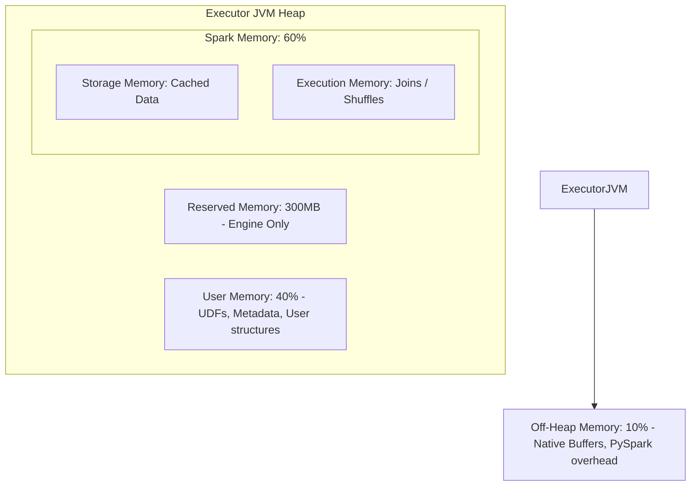

# 📊 Spark 메모리 및 자원 설계 가이드 (Production Resource Planning)

로컬 환경에서 겪으신 `GCLocker OOM` 및 `GC Thrashing` 현상은 대규모 분산 데이터 처리를 다루는 엔지니어들이 가장 빈번하게 마주치는 핵심 과제 중 하나입니다. 

이 문서에서는 **"데이터 크기를 기반으로 어떻게 스파크 메모리를 측정하고, 클러스터를 설계할 것인가"**에 대한 실무 기준과 공식을 정리합니다.

---

## 1. 스파크 JVM 메모리 내부 구조 이해

스파크 메모리를 설계하기 전에, Executor가 사용하는 JVM 내부 메모리 분할 구조를 알아야 합니다.

> [!IMPORTANT]
> - **Storage Memory**와 **Execution Memory**는 서로의 영역이 부족할 때 동적으로 메모리를 빌려옵니다 (Unified Memory).
> - 하지만, **Execution Memory(조인/셔플)**는 실행 중에는 강제로 해제(Evict)할 수 없기 때문에, 캐시(`Storage`)가 밀려나게 됩니다.

---

## 2. 메모리 산정 및 측정 기법 (Sizing Formulas)

### ① 메모리 뻥튀기(Expansion Factor) 고려하기
데이터가 디스크(Parquet)에 저장되어 있을 때와 Spark JVM 메모리에 올라왔을 때의 크기는 완전히 다릅니다.
*   **Parquet / JSON 디스크 크기**: 압축 및 컬럼형 저장으로 매우 작음.
*   **Spark JVM Deserialized Object 크기**: **디스크 크기의 약 2배 ~ 5배로 팽창** (Java Object 오버헤드 때문).

> [!TIP]
> **캐시를 위한 메모리 설계 공식 (가장 기본)**
> $$\text{필요 Storage 메모리} = \text{Raw 데이터 크기} \times 3 \times \text{안전 계수 (1.2)}$$

### ② 적절한 파티션 크기 (`spark.sql.shuffle.partitions`) 계산
스파크의 기본 셔플 파티션 수인 `200`개는 소량 데이터에선 너무 많고, 대용량 데이터에선 너무 적습니다. 
*   **적정 파티션 1개의 크기**: **100MB ~ 200MB**가 업계 스탠다드입니다.
*   **공식**: 
    $$\text{셔플 파티션 수} = \frac{\text{하루 총 데이터 크기 (Uncompressed)}}{150\text{MB}}$$
    *   예: 하루 처리 데이터가 30GB인 경우 $\rightarrow 30,000\text{MB} / 150\text{MB} = 200$ 파티션이 적절합니다.
    *   현재 로컬 개발 환경에서는 가볍게 돌리기 위해 `spark.sql.shuffle.partitions = 8`로 낮춰놓은 상태입니다.

---

## 3. 프로덕션 클러스터 Sizing 설계 (Dataproc / EMR 기준)

실무에서 GCP Dataproc이나 AWS EMR 노드를 설계할 때 사용하는 **"황금 비율(Golden Ratio)"** 공식입니다.

### ① Executor당 코어 수 (CPU Cores)
*   **최적값: 5 Cores**
*   *이유*: 코어가 5개일 때 HDFS/GCS 파일 I/O 처리량이 병목 없이 가장 우수하며, 가비지 컬렉터(GC)의 대기 시간이 최소화됩니다. (5를 넘어가면 오히려 GC 성능이 떨어짐)

### ② Executor당 메모리 Sizing (Memory per Executor)
서버 1대의 가용 자원이 `CPU 16 Cores`, `RAM 64GB`인 노드를 사용한다고 가정해 봅시다.

1.  **OS 및 시스템 데몬용 마진 예약**: 코어 1개와 4GB RAM을 노드 자체를 위해 양보합니다.
    *   남은 자원: `15 Cores`, `60GB RAM`
2.  **노드당 Executor 배치**: Executor당 5 Cores를 주므로, 노드당 **3개의 Executor**를 띄울 수 있습니다.
    *   $15\text{ Cores} / 5\text{ Cores} = 3\text{ Executors}$
3.  **Executor당 메모리 분배**: 
    *   $60\text{GB} / 3\text{ Executors} = 20\text{GB}$
4.  **Off-Heap Overhead Memory 빼주기 (10% 규정)**:
    *   실제 `spark.executor.memory` = $20\text{GB} \times 0.9 = \mathbf{18\text{GB}}$
    *   오버헤드 메모리 `spark.executor.memoryOverhead` = $\mathbf{2\text{GB}}$

---

## 4. 실무에서 겪는 OOM 유형별 방어 조치

| OOM 유형 | 발생 원인 | 해결책 |
| :--- | :--- | :--- |
| **Driver OOM** | `collect()`, `show()` 등으로 너무 큰 데이터를 마스터 노드로 긁어왔을 때 | 1. 드라이버 메모리 증설 (`spark.driver.memory`)   2. `collect()` 지양하고 `write` 사용 |
| **Executor OOM / GC Thrashing** | `df.cache()` 사용량이 물리 메모리를 초과했을 때 | 1. `.cache()`를 `.persist(StorageLevel.MEMORY_AND_DISK_SER)`로 변경하여 메모리가 넘칠 때 디스크를 쓰게 하고 직렬화(SER)하여 용량 줄이기   2. 불필요한 캐싱 제거 |
| **Data Skew OOM** | 특정 조인 키(예: WETH 주소)에 데이터가 쏠려 1개 파티션만 비정상적으로 커질 때 | 1. **Broadcast Join** 활성화 (작은 테이블)   2. 살팅(Salting) 기법을 사용해 키 강제 분산 |

---

## 5. 결론: 개발자가 지켜야 할 Spark 작성 3계명

> [!WARNING]
> 1. **프로덕션 코드에서 `df.show()`, `df.count()`, `df.collect()` 사용 금지**:
>    * 개발 단계에서 디버깅용으로만 쓰고, Airflow에 배포할 때는 반드시 삭제하거나 로깅 레벨을 낮춰야 합니다.
> 2. **무분별한 `cache()` 자제**:
>    * 데이터프레임이 최소 **3번 이상** 중복 호출될 때만 캐시를 고려하고, 로컬 메모리가 작을 때는 사용하지 마세요.
> 3. **데이터 크기 모니터링**:
>    * 매일 들어오는 트랜잭션의 파일 크기를 모니터링하고, 데이터가 10배 늘어날 것에 대비해 `spark.sql.shuffle.partitions`를 동적으로 설정하거나 튜닝해야 합니다.
